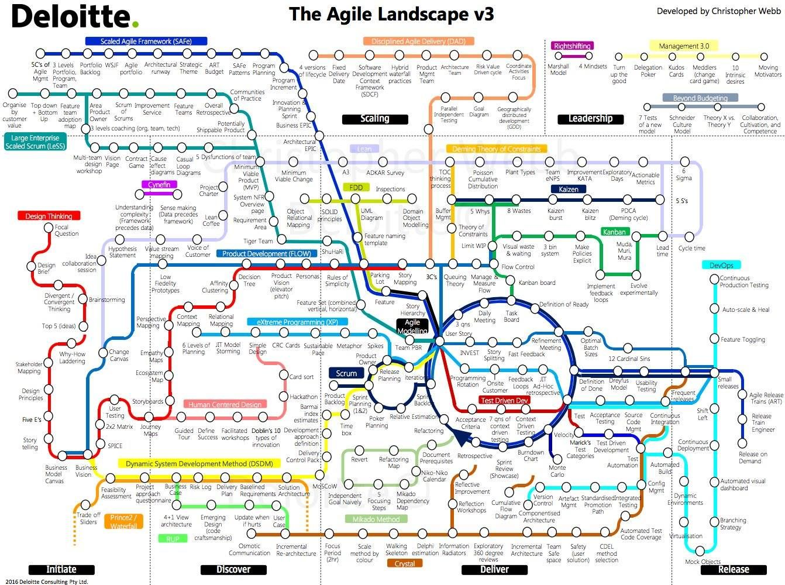

# Ohjelmointi45osp

## Projektinhallinta


### Scrum tiimi
**Mitä rooleja kuuluu Scrum-projekteihin? Mitä tehtäviä rooleihin kuuluu?**
```
Vastaa tähän...
```
### Suunnittelu
**Piirrä Scrum-malli, josta löytyvät ainakin seuraavat vaiheet, niiden sisältö, sekä niistä vastaavat tiimin jäsenet:**
- User stories / Käyttäjätarinat
- Product backlog / Tuotteen kehitysjono
- Sprint planning / Sprintin suunnittelu
- Sprint backlog / Sprintin kehitysjono
- Sprint / Sprintti
- Daily Scrum / Päivittäispalaveri
- Sprint review / Katselmointi
- Retrospective / Jälkipalaveri
- Deployment / Käyttöönotto

## Mitä DevOps tarkoittaa? Mitä CI/CD tarkoittaa? Voit ottaa asiasta selvää esimerkiksi seuraavan artikkelisarjan avulla
https://medium.com/@gwright_60924/software-delivery-for-beginners-series-intro-751b90fbe078

## JavaScript
**1. päivän koodiharjoitus kommentoituna:**
```
Vastaa tähän...
```
**Mitä eroa on const ja let muuttujilla?**
```
Vastaa tähän...
```
**Miksi var muuttujia ei enää käytetä?**
```
Vastaa tähän...
```
**2. päivän koodiharjoitus kommentoituna:**
```
Vastaa tähän...
```
**Mitä tarkoittaa ohjelmistokehittäjän etiikka? Miksi ohjelmistokehittäjän tulee ottaa eettiset näkökulmat huomioon? Voit ottaa asiasta selvää esimerkiksi seuraavien artikkelien avulla__
https://www.acm.org/code-of-ethics__
https://tivia.fi/toimiala/etiikan-ohjeet
**
```
Vastaa tähän...
```
